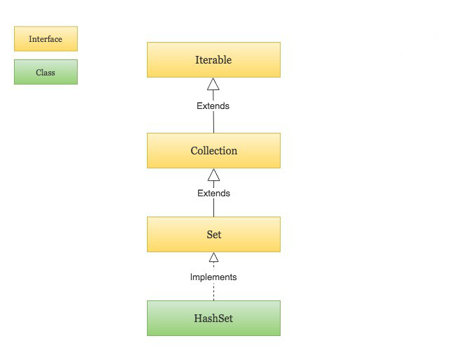

# Java HashSet

HashSet 基于 HashMap 来实现的，是一个不允许有重复元素的集合。

​    HashSet 允许有 null 值。

HashSet 是无序的，即不会记录插入的顺序。

HashSet 不是线程安全的， 如果多个线程尝试同时修改 HashSet，则最终结果是不确定的。 您必须在多线程访问时显式同步对 HashSet 的并发访问。

 HashSet 实现了 Set 接口。



HashSet 中的元素实际上是对象，一些常见的基本类型可以使用它的包装类。

基本类型对应的包装类表如下：

| 基本类型 | 引用类型  |
| -------- | --------- |
| boolean  | Boolean   |
| byte     | Byte      |
| short    | Short     |
| int      | Integer   |
| long     | Long      |
| float    | Float     |
| double   | Double    |
| char     | Character |

HashSet 类位于 java.util 包中，使用前需要引入它，语法格式如下：

```java
import java.util.HashSet; // 引入 HashSet 类
```

以下实例我们创建一个 HashSet 对象 sites，用于保存字符串元素：

```java
HashSet<String> sites = new HashSet<String>();
```

### 添加元素

HashSet 类提供了很多有用的方法，添加元素可以使用 add() 方法:

### 判断元素是否存在

我们可以使用 contains() 方法来判断元素是否存在于集合当中:

### 删除元素

我们可以使用 remove() 方法来删除集合中的元素:

删除集合中所有元素可以使用 clear 方法：

### 计算大小

如果要计算 HashSet 中的元素数量可以使用 size() 方法：

### 迭代 HashSet

可以使用 for-each 来迭代 HashSet 中的元素。